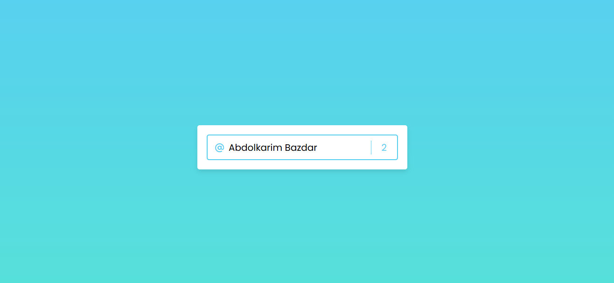

<div align="center">

# 🖊️ Username App
### Beautiful JavaScript Input for Users

<!-- Preview Image -->



<br/><br/>


</div>

---

## 📌 About The Project

**Username App** is a **minimal and elegant JavaScript application** that allows users to enter a username of up to **19 characters**.  

The app focuses on **clean UI**, **input validation**, and **user-friendly interaction**, making the username input experience smooth and beautiful.

---

## ✨ Features

- ✏️ Input a username up to 19 characters  
- 💡 Live validation & feedback  
- 🎨 Elegant and minimal design  
- ⚡ Lightweight and fast  
- 🧼 Clean and readable JavaScript code  

---

## 🛠 Tech Stack

| Technology | Purpose |
|----------|--------|
| HTML5 | Structure |
| CSS3 | Styling |
| JavaScript (ES6+) | Input logic & validation |

---

## 📂 Project Structure

```bash
├─ css
│  └─ style.css
├─ image
│  └─ preview.png
├─ index.html
├─ js
│  └─ script.js
├─ LICENSE
└─ README.md
 
```